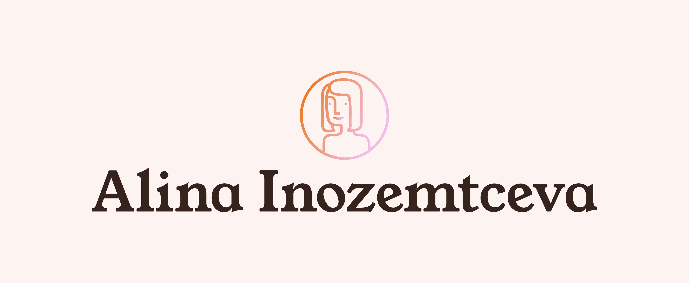
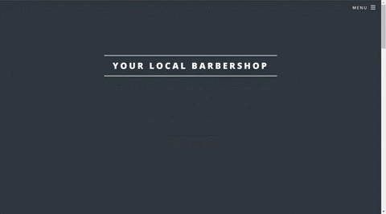

    
  
  
  
  
  

<h3 align="center">
  Passionate about seamless and accessible client experience   Software Developer
</h3>

  See <a href="https://inozemtceva-alina.netlify.app/">my website</a> for more information!

<h1 align="center"> My Projects</h1>
<table bordercolor="#66b2b2">
  
  <tr>
    <td width="50%" valign="top">
      <h3 align="center">Project name 1</h3>
         
        
         
        

              
  
      

        
<strong>Technology description</strong> - Project description

    </td>
    <td width="50%" valign="top">
      <h3 align="center">Your Local Barbershop</h3>
         
      
         
        

          
  
  
      

              
<strong>HTML5, CSS3 & JavaScript</strong> - Your local barbershop is a modern, blocky affair with a mobile-style menu, fully responsive styling, and an assortment of elements.

    </td>
  </tr>
  
   <tr>
    <td width="50%" valign="top">
      <h3 align="center">Portfolio</h3>
       
        
       
        

  
  
      

        
<strong>HTML5, CSS3, & Javascript</strong> - Portfolio Site including links to my projects and ways to get in contact with me.

    </td>
    <td width="50%" valign="top">
      <h3 align="center">Rock, Paper, Scissors</h3>
         
        
         
        

            
  
      

        
<strong>HTML5, CSS3, & Javascript</strong> - This is a simplified version of a Rock Paper Scissors game built with JavaScript

    </td>
  </tr>
</table>

<h1 align="center">Technologies</h1>

    
    
    
    
    
    

